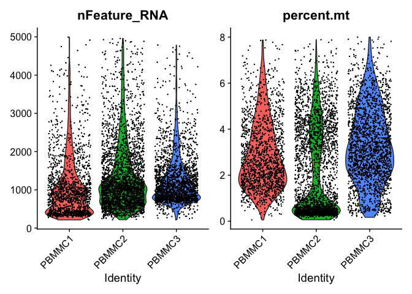
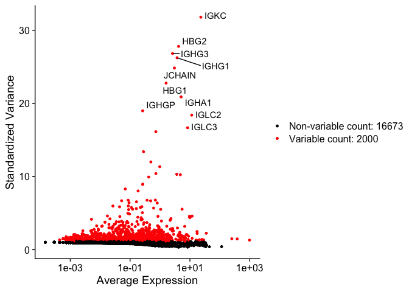
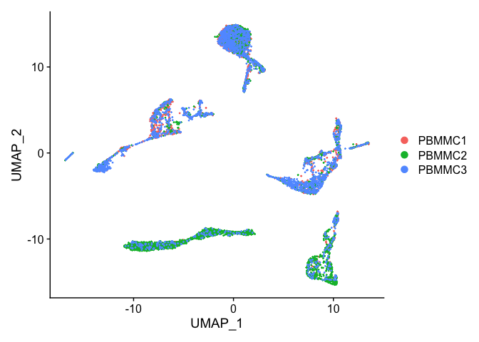

scRNA_analysis
================
Kiran Adhikari
7/21/2025

##### Load required libraries

``` r
library(Seurat)
library(tidyverse)
library(clustree)
library(celldex)
library(SingleR)
library(pheatmap)
library(edgeR)
library(limma)
```

##### Create a datadirs object specifying paths of count directories for each sample

``` r
datadirs <- c(PBMMC1 = "./Data/PBMMC-1/",
              PBMMC2 = "./Data/PBMMC-2/",
              PBMMC3 = "./Data/PBMMC-3/")
datadirs
```

    ##            PBMMC1            PBMMC2            PBMMC3 
    ## "./Data/PBMMC-1/" "./Data/PBMMC-2/" "./Data/PBMMC-3/"

``` r
#data_list <- lapply(datadirs, Read10X)
```

##### Load the dataset and generate a sparse matrix

``` r
Data_sparse_matrix <- Read10X(data.dir = datadirs)
```

##### Creating seurat object from sparse matrix keeping genes that are expressed in at least 3 cells and cells that have atleast 100 genes/features.

``` r
Data_seurat.object <- CreateSeuratObject(counts = Data_sparse_matrix, project = "PBMMC", min.cells = 3, min.features = 100)
```

    ## Warning: Feature names cannot have underscores ('_'), replacing with dashes
    ## ('-')

``` r
str(Data_seurat.object)
```

    ## Formal class 'Seurat' [package "SeuratObject"] with 13 slots
    ##   ..@ assays      :List of 1
    ##   .. ..$ RNA:Formal class 'Assay' [package "SeuratObject"] with 8 slots
    ##   .. .. .. ..@ counts       :Formal class 'dgCMatrix' [package "Matrix"] with 6 slots
    ##   .. .. .. .. .. ..@ i       : int [1:8907758] 2 27 60 98 117 127 174 217 230 243 ...
    ##   .. .. .. .. .. ..@ p       : int [1:6947] 0 909 1669 2884 3778 4508 7616 9619 11345 13635 ...
    ##   .. .. .. .. .. ..@ Dim     : int [1:2] 18673 6946
    ##   .. .. .. .. .. ..@ Dimnames:List of 2
    ##   .. .. .. .. .. .. ..$ : chr [1:18673] "RP11-34P13.7" "FO538757.3" "FO538757.2" "AP006222.2" ...
    ##   .. .. .. .. .. .. ..$ : chr [1:6946] "PBMMC1_AAACCTGCAGACGCAA-1" "PBMMC1_AAACCTGTCATCACCC-1" "PBMMC1_AAAGATGCATAAAGGT-1" "PBMMC1_AAAGCAAAGCAGCGTA-1" ...
    ##   .. .. .. .. .. ..@ x       : num [1:8907758] 1 1 1 9 1 1 1 1 1 3 ...
    ##   .. .. .. .. .. ..@ factors : list()
    ##   .. .. .. ..@ data         :Formal class 'dgCMatrix' [package "Matrix"] with 6 slots
    ##   .. .. .. .. .. ..@ i       : int [1:8907758] 2 27 60 98 117 127 174 217 230 243 ...
    ##   .. .. .. .. .. ..@ p       : int [1:6947] 0 909 1669 2884 3778 4508 7616 9619 11345 13635 ...
    ##   .. .. .. .. .. ..@ Dim     : int [1:2] 18673 6946
    ##   .. .. .. .. .. ..@ Dimnames:List of 2
    ##   .. .. .. .. .. .. ..$ : chr [1:18673] "RP11-34P13.7" "FO538757.3" "FO538757.2" "AP006222.2" ...
    ##   .. .. .. .. .. .. ..$ : chr [1:6946] "PBMMC1_AAACCTGCAGACGCAA-1" "PBMMC1_AAACCTGTCATCACCC-1" "PBMMC1_AAAGATGCATAAAGGT-1" "PBMMC1_AAAGCAAAGCAGCGTA-1" ...
    ##   .. .. .. .. .. ..@ x       : num [1:8907758] 1 1 1 9 1 1 1 1 1 3 ...
    ##   .. .. .. .. .. ..@ factors : list()
    ##   .. .. .. ..@ scale.data   : num[0 , 0 ] 
    ##   .. .. .. ..@ key          : chr "rna_"
    ##   .. .. .. ..@ assay.orig   : NULL
    ##   .. .. .. ..@ var.features : logi(0) 
    ##   .. .. .. ..@ meta.features:'data.frame':   18673 obs. of  0 variables
    ##   .. .. .. ..@ misc         : list()
    ##   ..@ meta.data   :'data.frame': 6946 obs. of  3 variables:
    ##   .. ..$ orig.ident  : Factor w/ 3 levels "PBMMC1","PBMMC2",..: 1 1 1 1 1 1 1 1 1 1 ...
    ##   .. ..$ nCount_RNA  : num [1:6946] 2401 3532 3972 3569 2982 ...
    ##   .. ..$ nFeature_RNA: int [1:6946] 909 760 1215 894 730 3108 2003 1726 2290 980 ...
    ##   ..@ active.assay: chr "RNA"
    ##   ..@ active.ident: Factor w/ 3 levels "PBMMC1","PBMMC2",..: 1 1 1 1 1 1 1 1 1 1 ...
    ##   .. ..- attr(*, "names")= chr [1:6946] "PBMMC1_AAACCTGCAGACGCAA-1" "PBMMC1_AAACCTGTCATCACCC-1" "PBMMC1_AAAGATGCATAAAGGT-1" "PBMMC1_AAAGCAAAGCAGCGTA-1" ...
    ##   ..@ graphs      : list()
    ##   ..@ neighbors   : list()
    ##   ..@ reductions  : list()
    ##   ..@ images      : list()
    ##   ..@ project.name: chr "PBMMC"
    ##   ..@ misc        : list()
    ##   ..@ version     :Classes 'package_version', 'numeric_version'  hidden list of 1
    ##   .. ..$ : int [1:3] 4 1 2
    ##   ..@ commands    : list()
    ##   ..@ tools       : list()

#### Quality control

##### Mitochondrial genes

``` r
Data_seurat.object <- PercentageFeatureSet(Data_seurat.object, pattern = "^MT-", col.name = "percent.mt")
```

##### Ribosomal genes

``` r
Data_seurat.object <- PercentageFeatureSet(Data_seurat.object, pattern = "^RP[SL]", col.name = "percent.ribo")
```

##### Hemoglobin genes (but not HBP)

``` r
Data_seurat.object <- PercentageFeatureSet(Data_seurat.object, pattern = "^HB[^(P)]", col.name = "percent.globin")
head(Data_seurat.object@meta.data)
```

    ##                           orig.ident nCount_RNA nFeature_RNA percent.mt
    ## PBMMC1_AAACCTGCAGACGCAA-1     PBMMC1       2401          909   2.540608
    ## PBMMC1_AAACCTGTCATCACCC-1     PBMMC1       3532          760   5.181200
    ## PBMMC1_AAAGATGCATAAAGGT-1     PBMMC1       3972         1215   4.934542
    ## PBMMC1_AAAGCAAAGCAGCGTA-1     PBMMC1       3569          894   3.250210
    ## PBMMC1_AAAGCAACAATAACGA-1     PBMMC1       2982          730   3.688799
    ## PBMMC1_AAAGCAACATCAGTCA-1     PBMMC1      22284         3108   3.181655
    ##                           percent.ribo percent.globin
    ## PBMMC1_AAACCTGCAGACGCAA-1     28.65473      0.1665973
    ## PBMMC1_AAACCTGTCATCACCC-1     55.03964      0.1981880
    ## PBMMC1_AAAGATGCATAAAGGT-1     30.43807      0.3776435
    ## PBMMC1_AAAGCAAAGCAGCGTA-1     55.02942      0.3642477
    ## PBMMC1_AAAGCAACAATAACGA-1     54.49363      0.1006036
    ## PBMMC1_AAAGCAACATCAGTCA-1     23.40693     36.9682283

##### Visualzing these features as violin plots

``` r
VlnPlot(Data_seurat.object, features = c("nFeature_RNA", "nCount_RNA"), ncol = 2)
```

<!-- -->

##### Plotting two features together

``` r
FeatureScatter(Data_seurat.object, feature1 = "nCount_RNA", feature2 = "nFeature_RNA") + geom_smooth(method = 'lm')
```

    ## `geom_smooth()` using formula = 'y ~ x'

<!-- -->

##### Plotting mitochondrial, ribosomal, and globin genes

``` r
VlnPlot(Data_seurat.object, features = c("percent.mt", "percent.ribo", "percent.globin"))
```

<!-- -->

##### PBMMC-2 has loq ribosomal counts and high globin counts. Seems they have a strong negative correlation suggesting presence of erythrocytes

``` r
FeatureScatter(Data_seurat.object, feature1 = "percent.globin", feature2 = "percent.ribo")
```

<!-- -->

##### Filtering cells based on the paper i.e. >200 features per cell, \<8% of mitochondrial counts. Also filtering out cells that have \>5000 detected features/cell to remove possible doublets

``` r
Data_seurat.object<- subset(Data_seurat.object, subset = nFeature_RNA > 200 & nFeature_RNA < 5000 & percent.mt < 8)
Data_seurat.object
```

    ## An object of class Seurat 
    ## 18673 features across 6830 samples within 1 assay 
    ## Active assay: RNA (18673 features, 0 variable features)

##### Visualizing data again to make sure the filters worked properly

``` r
VlnPlot(Data_seurat.object, features = c("nFeature_RNA", "percent.mt"))
```

<!-- -->

##### Normalizing the data with default LogNormalize and scale factor of 1e4

``` r
Data_seurat.object<- NormalizeData(Data_seurat.object) 
```

##### Identify highly variable features

``` r
Data_seurat.object<- FindVariableFeatures(Data_seurat.object, selection.method = "vst", nfeatures = 2000)
```

##### Identify the top 10 variable features and plot them

``` r
top10<- head(VariableFeatures(Data_seurat.object), 10)
top10
```

    ##  [1] "IGKC"   "HBG2"   "IGHG3"  "IGHG1"  "JCHAIN" "HBG1"   "IGHA1"  "IGHGP" 
    ##  [9] "IGLC2"  "IGLC3"

``` r
VF_Plot<- VariableFeaturePlot(Data_seurat.object)
LabelPoints(plot = VF_Plot, points = top10, repel = TRUE)
```

    ## When using repel, set xnudge and ynudge to 0 for optimal results

<!-- -->

##### Scaling (Linear transformation) the data to remove any sort of biases in sample collection or processing. This shifts expression of each gene such that mean expression across all cells is 0 Scales the expression of each gene such that variance across all cells is 1. This makes sure that highly DE genes do not dominate downstream analysis

``` r
Data_seurat.object <- ScaleData(Data_seurat.object, features = rownames(Data_seurat.object))
```

    ## Centering and scaling data matrix

##### Perform Linear dimensionality reduction (PCA) and visualize

``` r
Data_seurat.object <- RunPCA(Data_seurat.object)
```

    ## PC_ 1 
    ## Positive:  TUBB, TUBA1B, KIAA0101, HMGB2, HMGB1, NUSAP1, HIST1H4C, SMC4, TOP2A, H2AFZ 
    ##     TYMS, HMGN2, DEK, MKI67, RRM2, BIRC5, PCNA, PTTG1, DUT, CDK1 
    ##     STMN1, CCNA2, RAN, CKS1B, CENPF, UBE2T, CENPU, ZWINT, SMC2, NUCKS1 
    ## Negative:  IL32, LTB, IFIT1B, TRAC, KRT1, IFITM1, CD3G, TRBC1, TRBC2, BPGM 
    ##     FTL, FCN1, CD27, CD8B, COTL1, S100A12, S100A10, ARL4A, CD2, VCAN 
    ##     TNFAIP3, TYROBP, S100A11, CD14, GIMAP4, TMCC2, FCER1G, SERPINA1, MNDA, IL7R 
    ## PC_ 2 
    ## Positive:  VIM, ACTG1, CD74, GAPDH, RPS2, HLA-DRA, PTMA, HLA-DRB1, SRGN, MT-CO3 
    ##     AIF1, AP1S2, TYROBP, FCER1G, HNRNPA1, CST3, RPL37A, AC090498.1, LGALS1, LST1 
    ##     CTSS, RPL23, S100A11, PKM, GSTP1, MNDA, ENO1, ANXA1, HLA-DQB1, SPI1 
    ## Negative:  ALAS2, SLC4A1, SLC25A37, HBM, GYPA, AHSP, CA1, GYPB, HBD, HEMGN 
    ##     IFI27, FECH, HMBS, HBA1, BLVRB, EPB42, SELENBP1, RHAG, HBB, HBA2 
    ##     CA2, SMIM1, KLF1, FAM210B, PRDX2, RHCE, TSPO2, RFESD, STOM, BPGM 
    ## PC_ 3 
    ## Positive:  LYZ, CD36, MNDA, TYROBP, FCN1, S100A9, CST3, FCER1G, S100A4, VCAN 
    ##     S100A8, S100A11, S100A6, LGALS1, CSTA, TYMP, PSAP, LST1, S100A12, FGL2 
    ##     SERPINA1, CD14, CFD, CXCL8, MS4A6A, KLF4, SRGN, FTH1, BLVRB, CLEC12A 
    ## Negative:  CD24, IGLL1, SOX4, VPREB1, VPREB3, CD79B, ZNF90, CD79A, CMTM8, TCL1A 
    ##     LEF1, PDLIM1, IGLL5, EBF1, PTMA, LDHB, CD9, AC090498.1, LTB, STMN1 
    ##     MSI2, RCSD1, NPM1, MME, FAM129C, TIFA, PARP1, POU2AF1, SSBP2, EEF1B2 
    ## PC_ 4 
    ## Positive:  CD79B, CD24, TCL1A, CD9, VPREB3, UBE2C, IGHM, TOP2A, NUSAP1, VPREB1 
    ##     IGLL5, KIAA0226L, CD79A, AURKB, CENPA, CFAP73, MKI67, PLK1, GTSE1, RGS2 
    ##     FAM129C, IGLL1, CDCA8, HLA-DRA, PCDH9, IRF4, IGLC5, ASPM, HMMR, TIFA 
    ## Negative:  HSP90AB1, FAM178B, APOC1, CNRIP1, PRSS57, RPS2, RPL37A, EEF1B2, KCNH2, RPL23 
    ##     RPL7A, HSPD1, CYTL1, NME4, SYNGR1, RPLP0, AKR1C3, EPCAM, NPM1, LDHB 
    ##     MYC, AC090498.1, HSPE1, MIF, FKBP4, C1QBP, NME1, MLLT3, SRM, EBPL 
    ## PC_ 5 
    ## Positive:  IFITM1, IL32, TRAC, CD3G, TRBC1, TRBC2, AC090498.1, LTB, RPL37A, CD2 
    ##     IL7R, RPS2, TNFAIP3, CD8B, CD27, RPL23, CENPE, MT-CO3, ASPM, HMMR 
    ##     ITM2A, RORA, GIMAP4, DEPDC1, DLGAP5, PLK1, KIF23, AURKA, CENPA, TRAT1 
    ## Negative:  IFIT1B, BPGM, TRIM58, TMCC2, KRT1, ARL4A, SLC25A37, CLIC2, HLA-DRA, ALAS2 
    ##     EIF1AY, LPIN2, XPO7, HBB, IFI27, HBD, HBA2, HBA1, SELENBP1, SLC40A1 
    ##     LGALS3, FECH, ARG1, SLC2A1, CD74, IGHM, MOSPD1, MZB1, IGKC, ANKRD9

``` r
DimPlot(Data_seurat.object, reduction = "pca")
```

<!-- -->

##### Generating heat map (for first 6 PCs) based on PC scores calculated

``` r
DimHeatmap(Data_seurat.object, dims = 1:6, cells = 500, balanced = TRUE)
```

<!-- -->

##### Generating elbowplot to determine number of PCs for downstream analysis

``` r
ElbowPlot(Data_seurat.object, ndims = 40)
```

<!-- -->

##### The elbow appears to be around 25 and we will be using 25 dimensions for downstream analysis

``` r
Data_seurat.object <- RunUMAP(Data_seurat.object, dims = 1:25)
```

    ## Warning: The default method for RunUMAP has changed from calling Python UMAP via reticulate to the R-native UWOT using the cosine metric
    ## To use Python UMAP via reticulate, set umap.method to 'umap-learn' and metric to 'correlation'
    ## This message will be shown once per session

    ## 15:31:31 UMAP embedding parameters a = 0.9922 b = 1.112

    ## 15:31:31 Read 6830 rows and found 25 numeric columns

    ## 15:31:31 Using Annoy for neighbor search, n_neighbors = 30

    ## 15:31:31 Building Annoy index with metric = cosine, n_trees = 50

    ## 0%   10   20   30   40   50   60   70   80   90   100%

    ## [----|----|----|----|----|----|----|----|----|----|

    ## **************************************************|
    ## 15:31:31 Writing NN index file to temp file /var/folders/_c/41kjjyt15851lw5v_qv8rytn9hh6_6/T//RtmpBqdiko/file16b01a0387a1
    ## 15:31:31 Searching Annoy index using 1 thread, search_k = 3000
    ## 15:31:32 Annoy recall = 100%
    ## 15:31:33 Commencing smooth kNN distance calibration using 1 thread with target n_neighbors = 30
    ## 15:31:34 Initializing from normalized Laplacian + noise (using irlba)
    ## 15:31:34 Commencing optimization for 500 epochs, with 284056 positive edges
    ## 15:31:45 Optimization finished

``` r
DimPlot(Data_seurat.object, reduction = "umap")
```

<!-- -->

##### We can see that cells from different samples are clustered together but also there is some kind of separation within clusters. So we will perform integration. For which, we will first split the object by sample. We then do a log normalization, and identify variable features individually for each dataset using ‘vst’

``` r
Data_list <- SplitObject(Data_seurat.object, split.by = "orig.ident")

for (i in 1: length (Data_list)) {
  Data_list[[i]] <- NormalizeData(Data_list[[i]])
  Data_list[[i]] <- FindVariableFeatures(Data_list[[i]], selection.method = "vst", nfeatures = 2000, verbose = FALSE)
}
```

##### Preparing for integration by selecting integration anchors

``` r
Data_anchors <- FindIntegrationAnchors(Data_list, dims = 1:25)
```

    ## Computing 2000 integration features

    ## Scaling features for provided objects

    ## Finding all pairwise anchors

    ## Running CCA

    ## Merging objects

    ## Finding neighborhoods

    ## Finding anchors

    ##  Found 4302 anchors

    ## Filtering anchors

    ##  Retained 2272 anchors

    ## Running CCA

    ## Merging objects

    ## Finding neighborhoods

    ## Finding anchors

    ##  Found 4313 anchors

    ## Filtering anchors

    ##  Retained 3367 anchors

    ## Running CCA

    ## Merging objects

    ## Finding neighborhoods

    ## Finding anchors

    ##  Found 4672 anchors

    ## Filtering anchors

    ##  Retained 3622 anchors

##### Performing integration

``` r
Data_int <- IntegrateData(Data_anchors, dims = 1:25)
```

    ## Merging dataset 1 into 3

    ## Extracting anchors for merged samples

    ## Finding integration vectors

    ## Finding integration vector weights

    ## Integrating data

    ## Merging dataset 2 into 3 1

    ## Extracting anchors for merged samples

    ## Finding integration vectors

    ## Finding integration vector weights

    ## Integrating data

##### Now switch the deafult ‘Assay’ to ‘Integrated’ got clustering and visualization

``` r
DefaultAssay(Data_int) <- "integrated"
```

##### Performing the scaling, PCA, and UMAP on integrated data

``` r
Data_int <- ScaleData(Data_int)
```

    ## Centering and scaling data matrix

``` r
Data_int <- RunPCA(Data_int, npcs = 30)
```

    ## PC_ 1 
    ## Positive:  HBA2, BNIP3L, BPGM, HBA1, HBB, KRT1, CD52, TRAC, TMCC2, TRBC2 
    ##     IFIT1B, LTB, TRBC1, ARL4A, GMPR, SLC25A37, CD3G, S100A8, SNCA, CD8B 
    ##     DUSP2, FTL, CD27, NR4A2, FCN1, IL32, FAM46C, S100A12, COTL1, TRIM58 
    ## Negative:  KIAA0101, TUBB, TUBA1B, HMGB1, HMGB2, H2AFZ, TYMS, STMN1, HMGN2, PCNA 
    ##     NUSAP1, DEK, DUT, YWHAQ, UHRF1, TOP2A, ZWINT, SMC4, RRM2, MAD2L1 
    ##     HSP90AA1, PTMA, IGLL1, HMGA1, MCM7, HIST1H4C, CDK1, RAN, H2AFY, RANBP1 
    ## PC_ 2 
    ## Positive:  SRGN, CST3, FCER1G, TMSB4X, MNDA, S100A11, TYROBP, VIM, AIF1, KLF4 
    ##     LYZ, CH17-373J23.1, ZFP36, ANXA1, LST1, LGALS1, CTSS, FCN1, CLEC12A, CFD 
    ##     TYMP, HLA-DRB1, TMEM107, ACTB, CFP, AP1S2, ARPC1B, GRN, CSTA, VCAN 
    ## Negative:  HBB, HBA1, ALAS2, HBD, HBA2, AHSP, GYPB, SLC25A37, CA1, SLC4A1 
    ##     GYPA, SNCA, HBM, HEMGN, SLC25A39, HMBS, FECH, SELENBP1, RHAG, GYPC 
    ##     STRADB, PRDX2, RFESD, EPB42, HBQ1, CA2, BPGM, SLC2A1, FAM210B, CPOX 
    ## PC_ 3 
    ## Positive:  LEF1, RPS23, CD24, PTMA, HNRNPA1, LDHB, TRAC, NPM1, SOX4, LTB 
    ##     RPS2, IL7R, TMSB4X, HMGN1, IGLL1, CD79A, CD79B, MARCKSL1, RPLP0, IGHM 
    ##     EEF1B2, TRBC2, VPREB1, EBF1, RCSD1, VPREB3, POU2AF1, IGLL5, MIF, TIFA 
    ## Negative:  BLVRB, CD36, AHSP, GYPA, CA2, TYROBP, HBD, S100A9, GYPB, HBM 
    ##     HMBS, LYZ, SLC4A1, HEMGN, S100A8, RHAG, CPOX, FCN1, MNDA, MGST3 
    ##     RFESD, S100A4, ALAS2, S100A12, CFD, S100A6, CST3, UROD, CA1, FCER1G 
    ## PC_ 4 
    ## Positive:  CD79B, CD9, TCL1A, CD24, TOP2A, UBE2C, VPREB3, NUSAP1, VPREB1, AURKB 
    ##     POU2AF1, IGLL5, MKI67, KIAA0226L, CD79A, FAM64A, CEP55, RAG2, CENPA, IGHM 
    ##     TIFA, RGS2, TMSB15A, GTSE1, IGLL1, PLK1, HLA-DRA, HMMR, RACGAP1, IGLC5 
    ## Negative:  RPS2, FAM178B, HSP90AB1, CNRIP1, APOC1, RPLP0, RPL37A, RPS23, EEF1B2, RPL7A 
    ##     SLC39A8, NME4, PRSS57, CYTL1, KCNH2, EPCAM, AKR1C3, RPL23, SYNGR1, HSPB1 
    ##     ALDH1A1, IMPDH2, NPM1, LDHB, ABO, MYC, FKBP4, MLLT3, ITM2A, HSPE1 
    ## PC_ 5 
    ## Positive:  TRAC, TMSB4X, CD52, IL32, TRBC1, TRBC2, MT-CO2, MT-ND2, LTB, CD3G 
    ##     MT-CO1, MT-CYB, MT-ND4, IL7R, CD27, RPL37A, MT-CO3, CD2, RPS2, RPS23 
    ##     PASK, CD8B, PLK1, DLGAP5, HSPA8, GIMAP4, DUSP2, TC2N, ACTB, CDC20 
    ## Negative:  BNIP3L, BPGM, HBA2, SNCA, TMCC2, HBA1, ITM2C, KRT1, SLC25A37, HBB 
    ##     GMPR, IFIT1B, HLA-DRA, CD74, JCHAIN, KIAA0125, SPINK2, SMIM24, ARL4A, TRIM58 
    ##     HBG2, PRSS57, HBD, STRADB, EGFL7, MZB1, HBG1, BCL11A, HLA-DRB1, PLD4

``` r
Data_int <- RunUMAP(Data_int, reduction = "pca", dims = 1:25)
```

    ## 15:32:55 UMAP embedding parameters a = 0.9922 b = 1.112

    ## 15:32:55 Read 6830 rows and found 25 numeric columns

    ## 15:32:55 Using Annoy for neighbor search, n_neighbors = 30

    ## 15:32:55 Building Annoy index with metric = cosine, n_trees = 50

    ## 0%   10   20   30   40   50   60   70   80   90   100%

    ## [----|----|----|----|----|----|----|----|----|----|

    ## **************************************************|
    ## 15:32:55 Writing NN index file to temp file /var/folders/_c/41kjjyt15851lw5v_qv8rytn9hh6_6/T//RtmpBqdiko/file16b0d701122
    ## 15:32:55 Searching Annoy index using 1 thread, search_k = 3000
    ## 15:32:56 Annoy recall = 100%
    ## 15:32:57 Commencing smooth kNN distance calibration using 1 thread with target n_neighbors = 30
    ## 15:32:58 Initializing from normalized Laplacian + noise (using irlba)
    ## 15:32:59 Commencing optimization for 500 epochs, with 293796 positive edges
    ## 15:33:10 Optimization finished

``` r
DimPlot(Data_int, reduction = "umap")
```

<!-- -->

##### Clustering the integrated data

``` r
Data_int <- FindNeighbors(Data_int, dims = 1:25)
```

    ## Computing nearest neighbor graph

    ## Computing SNN

##### Assigning the cells to clusters

``` r
Data_int <- FindClusters(Data_int, resolution = seq(0.1, 0.8, by = 0.1))
```

    ## Modularity Optimizer version 1.3.0 by Ludo Waltman and Nees Jan van Eck
    ## 
    ## Number of nodes: 6830
    ## Number of edges: 300173
    ## 
    ## Running Louvain algorithm...
    ## Maximum modularity in 10 random starts: 0.9774
    ## Number of communities: 7
    ## Elapsed time: 0 seconds
    ## Modularity Optimizer version 1.3.0 by Ludo Waltman and Nees Jan van Eck
    ## 
    ## Number of nodes: 6830
    ## Number of edges: 300173
    ## 
    ## Running Louvain algorithm...
    ## Maximum modularity in 10 random starts: 0.9635
    ## Number of communities: 12
    ## Elapsed time: 0 seconds
    ## Modularity Optimizer version 1.3.0 by Ludo Waltman and Nees Jan van Eck
    ## 
    ## Number of nodes: 6830
    ## Number of edges: 300173
    ## 
    ## Running Louvain algorithm...
    ## Maximum modularity in 10 random starts: 0.9516
    ## Number of communities: 13
    ## Elapsed time: 0 seconds
    ## Modularity Optimizer version 1.3.0 by Ludo Waltman and Nees Jan van Eck
    ## 
    ## Number of nodes: 6830
    ## Number of edges: 300173
    ## 
    ## Running Louvain algorithm...
    ## Maximum modularity in 10 random starts: 0.9401
    ## Number of communities: 13
    ## Elapsed time: 0 seconds
    ## Modularity Optimizer version 1.3.0 by Ludo Waltman and Nees Jan van Eck
    ## 
    ## Number of nodes: 6830
    ## Number of edges: 300173
    ## 
    ## Running Louvain algorithm...
    ## Maximum modularity in 10 random starts: 0.9286
    ## Number of communities: 13
    ## Elapsed time: 0 seconds
    ## Modularity Optimizer version 1.3.0 by Ludo Waltman and Nees Jan van Eck
    ## 
    ## Number of nodes: 6830
    ## Number of edges: 300173
    ## 
    ## Running Louvain algorithm...
    ## Maximum modularity in 10 random starts: 0.9174
    ## Number of communities: 15
    ## Elapsed time: 0 seconds
    ## Modularity Optimizer version 1.3.0 by Ludo Waltman and Nees Jan van Eck
    ## 
    ## Number of nodes: 6830
    ## Number of edges: 300173
    ## 
    ## Running Louvain algorithm...
    ## Maximum modularity in 10 random starts: 0.9065
    ## Number of communities: 17
    ## Elapsed time: 0 seconds
    ## Modularity Optimizer version 1.3.0 by Ludo Waltman and Nees Jan van Eck
    ## 
    ## Number of nodes: 6830
    ## Number of edges: 300173
    ## 
    ## Running Louvain algorithm...
    ## Maximum modularity in 10 random starts: 0.8960
    ## Number of communities: 19
    ## Elapsed time: 0 seconds

``` r
head(Data_int@meta.data)
```

    ##                           orig.ident nCount_RNA nFeature_RNA percent.mt
    ## PBMMC1_AAACCTGCAGACGCAA-1     PBMMC1       2401          909   2.540608
    ## PBMMC1_AAACCTGTCATCACCC-1     PBMMC1       3532          760   5.181200
    ## PBMMC1_AAAGATGCATAAAGGT-1     PBMMC1       3972         1215   4.934542
    ## PBMMC1_AAAGCAAAGCAGCGTA-1     PBMMC1       3569          894   3.250210
    ## PBMMC1_AAAGCAACAATAACGA-1     PBMMC1       2982          730   3.688799
    ## PBMMC1_AAAGCAACATCAGTCA-1     PBMMC1      22284         3108   3.181655
    ##                           percent.ribo percent.globin integrated_snn_res.0.1
    ## PBMMC1_AAACCTGCAGACGCAA-1     28.65473      0.1665973                      5
    ## PBMMC1_AAACCTGTCATCACCC-1     55.03964      0.1981880                      0
    ## PBMMC1_AAAGATGCATAAAGGT-1     30.43807      0.3776435                      2
    ## PBMMC1_AAAGCAAAGCAGCGTA-1     55.02942      0.3642477                      0
    ## PBMMC1_AAAGCAACAATAACGA-1     54.49363      0.1006036                      0
    ## PBMMC1_AAAGCAACATCAGTCA-1     23.40693     36.9682283                      4
    ##                           integrated_snn_res.0.2 integrated_snn_res.0.3
    ## PBMMC1_AAACCTGCAGACGCAA-1                      7                      7
    ## PBMMC1_AAACCTGTCATCACCC-1                      0                      0
    ## PBMMC1_AAAGATGCATAAAGGT-1                      2                      2
    ## PBMMC1_AAAGCAAAGCAGCGTA-1                      0                      0
    ## PBMMC1_AAAGCAACAATAACGA-1                      0                      0
    ## PBMMC1_AAAGCAACATCAGTCA-1                      3                      5
    ##                           integrated_snn_res.0.4 integrated_snn_res.0.5
    ## PBMMC1_AAACCTGCAGACGCAA-1                      7                      7
    ## PBMMC1_AAACCTGTCATCACCC-1                      0                      0
    ## PBMMC1_AAAGATGCATAAAGGT-1                      2                      2
    ## PBMMC1_AAAGCAAAGCAGCGTA-1                      0                      0
    ## PBMMC1_AAAGCAACAATAACGA-1                      0                      0
    ## PBMMC1_AAAGCAACATCAGTCA-1                      5                      5
    ##                           integrated_snn_res.0.6 integrated_snn_res.0.7
    ## PBMMC1_AAACCTGCAGACGCAA-1                      6                      8
    ## PBMMC1_AAACCTGTCATCACCC-1                      0                      0
    ## PBMMC1_AAAGATGCATAAAGGT-1                      2                      2
    ## PBMMC1_AAAGCAAAGCAGCGTA-1                      0                      0
    ## PBMMC1_AAAGCAACAATAACGA-1                      0                      0
    ## PBMMC1_AAAGCAACATCAGTCA-1                      4                      4
    ##                           integrated_snn_res.0.8 seurat_clusters
    ## PBMMC1_AAACCTGCAGACGCAA-1                      9               9
    ## PBMMC1_AAACCTGTCATCACCC-1                      0               0
    ## PBMMC1_AAAGATGCATAAAGGT-1                      1               1
    ## PBMMC1_AAAGCAAAGCAGCGTA-1                      0               0
    ## PBMMC1_AAAGCAACAATAACGA-1                      0               0
    ## PBMMC1_AAAGCAACATCAGTCA-1                      3               3

##### View how clusters sub-divide at increasing resolution

``` r
clustree(Data_int@meta.data[, grep("integrated_snn_res", colnames(Data_int@meta.data))], prefix = "integrated_snn_res.")
```

<!-- -->

##### UMAP coloring each cell according to a cluster id

``` r
DimPlot(Data_int, group.by = "integrated_snn_res.0.3")
```

<!-- -->

#### Cell annotation

##### Since clustering at a resolution of 0.3 provided most sensible results, we will set the identity of each cell based on this clustering

``` r
Data_int <- SetIdent(Data_int, value = Data_int$integrated_snn_res.0.3)
```

##### Now we will use original data count and not the integrated data for cell annotation

``` r
DefaultAssay(Data_int) <- "RNA"
```

##### Visualing expression of a gene in cluster based on the UMAP generated

``` r
FeaturePlot(Data_int, "HBA1")
```

<!-- -->

##### Manual cell type annotation can be done as well. For example for t cell genes

``` r
tcell_genes <- c("IL7R", "LTB", "TRAC", "CD3D")
FeaturePlot(Data_int, tcell_genes, ncol = 2)
```

<!-- -->

##### t-cell genes seem to be present in cluster 0 and 8 and we can make sure by plotting them in violin plots

``` r
VlnPlot(Data_int, tcell_genes, ncol = 2)
```

<!-- -->

##### Automating with AddModuleScore

``` r
Data_int <- AddModuleScore(Data_int, features=list(tcell_genes), name = "tcell_genes")
head(Data_int@meta.data)
```

    ##                           orig.ident nCount_RNA nFeature_RNA percent.mt
    ## PBMMC1_AAACCTGCAGACGCAA-1     PBMMC1       2401          909   2.540608
    ## PBMMC1_AAACCTGTCATCACCC-1     PBMMC1       3532          760   5.181200
    ## PBMMC1_AAAGATGCATAAAGGT-1     PBMMC1       3972         1215   4.934542
    ## PBMMC1_AAAGCAAAGCAGCGTA-1     PBMMC1       3569          894   3.250210
    ## PBMMC1_AAAGCAACAATAACGA-1     PBMMC1       2982          730   3.688799
    ## PBMMC1_AAAGCAACATCAGTCA-1     PBMMC1      22284         3108   3.181655
    ##                           percent.ribo percent.globin integrated_snn_res.0.1
    ## PBMMC1_AAACCTGCAGACGCAA-1     28.65473      0.1665973                      5
    ## PBMMC1_AAACCTGTCATCACCC-1     55.03964      0.1981880                      0
    ## PBMMC1_AAAGATGCATAAAGGT-1     30.43807      0.3776435                      2
    ## PBMMC1_AAAGCAAAGCAGCGTA-1     55.02942      0.3642477                      0
    ## PBMMC1_AAAGCAACAATAACGA-1     54.49363      0.1006036                      0
    ## PBMMC1_AAAGCAACATCAGTCA-1     23.40693     36.9682283                      4
    ##                           integrated_snn_res.0.2 integrated_snn_res.0.3
    ## PBMMC1_AAACCTGCAGACGCAA-1                      7                      7
    ## PBMMC1_AAACCTGTCATCACCC-1                      0                      0
    ## PBMMC1_AAAGATGCATAAAGGT-1                      2                      2
    ## PBMMC1_AAAGCAAAGCAGCGTA-1                      0                      0
    ## PBMMC1_AAAGCAACAATAACGA-1                      0                      0
    ## PBMMC1_AAAGCAACATCAGTCA-1                      3                      5
    ##                           integrated_snn_res.0.4 integrated_snn_res.0.5
    ## PBMMC1_AAACCTGCAGACGCAA-1                      7                      7
    ## PBMMC1_AAACCTGTCATCACCC-1                      0                      0
    ## PBMMC1_AAAGATGCATAAAGGT-1                      2                      2
    ## PBMMC1_AAAGCAAAGCAGCGTA-1                      0                      0
    ## PBMMC1_AAAGCAACAATAACGA-1                      0                      0
    ## PBMMC1_AAAGCAACATCAGTCA-1                      5                      5
    ##                           integrated_snn_res.0.6 integrated_snn_res.0.7
    ## PBMMC1_AAACCTGCAGACGCAA-1                      6                      8
    ## PBMMC1_AAACCTGTCATCACCC-1                      0                      0
    ## PBMMC1_AAAGATGCATAAAGGT-1                      2                      2
    ## PBMMC1_AAAGCAAAGCAGCGTA-1                      0                      0
    ## PBMMC1_AAAGCAACAATAACGA-1                      0                      0
    ## PBMMC1_AAAGCAACATCAGTCA-1                      4                      4
    ##                           integrated_snn_res.0.8 seurat_clusters tcell_genes1
    ## PBMMC1_AAACCTGCAGACGCAA-1                      9               9   -1.0508075
    ## PBMMC1_AAACCTGTCATCACCC-1                      0               0   -0.5675319
    ## PBMMC1_AAAGATGCATAAAGGT-1                      1               1   -1.1271753
    ## PBMMC1_AAAGCAAAGCAGCGTA-1                      0               0    0.8382644
    ## PBMMC1_AAAGCAACAATAACGA-1                      0               0   -0.5751041
    ## PBMMC1_AAAGCAACATCAGTCA-1                      3               3   -0.9449303

##### Plotting UMAP based on the new column generated on previous step

``` r
FeaturePlot(Data_int, "tcell_genes1")
```

<!-- -->

##### We can plot a violin plot as well

``` r
VlnPlot(Data_int, "tcell_genes1")
```

<!-- -->

##### Annotating cells according to cell cycling phase. First extracting the built-in genes

``` r
s.genes <- cc.genes.updated.2019$s.genes
g2m.genes <- cc.genes.updated.2019$g2m.genes
```

##### Now running the function and visualizing the annotations

``` r
Data_int <- CellCycleScoring(Data_int, s.features = s.genes, g2m.features = g2m.genes)
```

    ## Warning: The following features are not present in the object: PIMREG, JPT1, not
    ## searching for symbol synonyms

``` r
DimPlot(Data_int, group.by = "Phase")
```

<!-- -->

##### Cell type annotation using SingleR requires a reference dataset of primary cells. scRNA package has many reference datasets. Here we are using a reference dataset from celldex.

``` r
ref <- celldex::NovershternHematopoieticData()
```

    ## snapshotDate(): 2021-10-19

    ## see ?celldex and browseVignettes('celldex') for documentation

    ## loading from cache

    ## see ?celldex and browseVignettes('celldex') for documentation

    ## loading from cache

``` r
class(ref)
```

    ## [1] "SummarizedExperiment"
    ## attr(,"package")
    ## [1] "SummarizedExperiment"

``` r
table(ref$label.main)
```

    ## 
    ##         B cells       Basophils    CD4+ T cells    CD8+ T cells            CMPs 
    ##              29               6              21              24               4 
    ## Dendritic cells     Eosinophils Erythroid cells            GMPs    Granulocytes 
    ##              10               5              33               4              13 
    ##            HSCs  Megakaryocytes            MEPs       Monocytes        NK cells 
    ##              14              12               9               9              14 
    ##      NK T cells 
    ##               4

##### Comparing normalized count data to a reference set using SingleR

``` r
Data_int_SingleR <- SingleR(test = Seurat::GetAssayData(Data_int, slot = "data"), ref = ref, labels = ref$label.main)
head(Data_int_SingleR)
```

    ## DataFrame with 6 rows and 5 columns
    ##                                                   scores    first.labels
    ##                                                 <matrix>     <character>
    ## PBMMC1_AAACCTGCAGACGCAA-1 0.216202:0.197296:0.086435:...         B cells
    ## PBMMC1_AAACCTGTCATCACCC-1 0.143005:0.129582:0.170521:...    CD8+ T cells
    ## PBMMC1_AAAGATGCATAAAGGT-1 0.113423:0.196264:0.111341:...       Monocytes
    ## PBMMC1_AAAGCAAAGCAGCGTA-1 0.166749:0.168504:0.239303:...    CD4+ T cells
    ## PBMMC1_AAAGCAACAATAACGA-1 0.102549:0.103979:0.178762:...    CD8+ T cells
    ## PBMMC1_AAAGCAACATCAGTCA-1 0.181526:0.147693:0.115841:... Erythroid cells
    ##                                tuning.scores          labels   pruned.labels
    ##                                  <DataFrame>     <character>     <character>
    ## PBMMC1_AAACCTGCAGACGCAA-1 0.208945:0.0618382         B cells         B cells
    ## PBMMC1_AAACCTGTCATCACCC-1 0.184068:0.1086988    CD8+ T cells    CD8+ T cells
    ## PBMMC1_AAAGATGCATAAAGGT-1 0.231595:0.1041421       Monocytes       Monocytes
    ## PBMMC1_AAAGCAAAGCAGCGTA-1 0.181474:0.0969475    CD4+ T cells    CD4+ T cells
    ## PBMMC1_AAAGCAACAATAACGA-1 0.192312:0.1315436    CD8+ T cells    CD8+ T cells
    ## PBMMC1_AAAGCAACATCAGTCA-1 0.323945:0.2182315 Erythroid cells Erythroid cells

##### Visualizing SingleR score quality scores

``` r
SingleR::plotScoreHeatmap(Data_int_SingleR)
```

<!-- -->

``` r
plotDeltaDistribution(Data_int_SingleR)
```

    ## Warning: Groups with fewer than two datapoints have been dropped.
    ## ℹ Set `drop = FALSE` to consider such groups for position adjustment purposes.

    ## Warning in max(data$density, na.rm = TRUE): no non-missing arguments to max;
    ## returning -Inf

    ## Warning: Computation failed in `stat_ydensity()`.
    ## Caused by error in `$<-.data.frame`:
    ## ! replacement has 1 row, data has 0

<!-- -->

##### Some annotations contain limited number of cells. So, removing them from annotation

``` r
singleR_labels <- Data_int_SingleR$labels
t <- table(singleR_labels)
other <- names(t)[t < 10]
singleR_labels[singleR_labels %in% other] <- "None"
```

##### for Visualizing in UMAP, first annotation is added to meta data and then plotting it

``` r
library(dittoSeq)
Data_int$SingleR_annot <- singleR_labels
dittoDimPlot(Data_int, "SingleR_annot", size = 0.7)
```

<!-- -->

##### Check for number of cells per sample for each annotated cell type

``` r
dittoBarPlot(Data_int, var = "SingleR_annot", group.by = "orig.ident")
```

<!-- -->

##### Visualizing the cell types based on cluster

``` r
dittoBarPlot(Data_int, var = "SingleR_annot", group.by = "integrated_snn_res.0.3")
```

<!-- -->
##### From the above plot we can see that clusters 0 and 8 contain cells
annotated as T cells (CD4+ and CD8+).

#### Differential gene expression

##### Finding markers for each cluster by testing genes that are expressed in atleast 25% of cells in either group and upregulated in each cluster

``` r
DE_genes <- FindAllMarkers(Data_int, min.pct = 0.25, only.pos = TRUE)
```

    ## Calculating cluster 0

    ## Calculating cluster 1

    ## Calculating cluster 2

    ## Calculating cluster 3

    ## Calculating cluster 4

    ## Calculating cluster 5

    ## Calculating cluster 6

    ## Calculating cluster 7

    ## Calculating cluster 8

    ## Calculating cluster 9

    ## Calculating cluster 10

    ## Calculating cluster 11

    ## Calculating cluster 12

##### Subsetting the table to keep only the significant genes

``` r
DE_sig <- subset(DE_genes, DE_genes$p_val_adj < 0.05)
#write.csv(DE_sig, "Significant_markers.csv", row.names = F, quote = F)
top_specific_markers <- DE_sig %>% group_by(cluster) %>% top_n(3, avg_log2FC)
```

##### Generating dotplot of top markers

``` r
dittoDotPlot(Data_int, vars = unique(top_specific_markers$gene), group.by = "integrated_snn_res.0.3")
```

<!-- -->

##### Checking to see if the T cell genes are among the significant marker genes

``` r
DE_sig[DE_sig$gene %in% tcell_genes,]
```

    ##               p_val avg_log2FC pct.1 pct.2     p_val_adj cluster gene
    ## CD3D   0.000000e+00  1.0435694 0.769 0.227  0.000000e+00       0 CD3D
    ## TRAC  5.396190e-292  0.8410533 0.619 0.204 1.007630e-287       0 TRAC
    ## LTB   3.852790e-271  0.8132276 0.759 0.394 7.194315e-267       0  LTB
    ## IL7R  9.359625e-212  0.6875962 0.437 0.114 1.747723e-207       0 IL7R
    ## LTB1   3.189753e-36  0.5400222 0.673 0.465  5.956225e-32       7  LTB
    ## TRAC1 5.007784e-113  0.9108652 0.759 0.274 9.351036e-109       8 TRAC
    ## CD3D1 5.913460e-106  0.8865485 0.798 0.326 1.104220e-101       8 CD3D
    ## LTB2   5.263279e-58  0.7084087 0.768 0.462  9.828120e-54       8  LTB
    ## IL7R1  9.410474e-45  0.5515534 0.461 0.173  1.757218e-40       8 IL7R
    ## LTB3   1.189440e-25  0.4964522 0.753 0.467  2.221042e-21      11  LTB

##### The table above shows some of the T-cell genes are highly significant markers for Clusters 0 and 8.

##### Differential expression between groups of cells (between clusters or specific cell types). First setting the default cell identity to cell types defined by Single R

``` r
Data_int <- SetIdent(Data_int, value = "SingleR_annot")
```

##### Now running the differential expression analysis and subsetting the table to keep significant genes

``` r
DE_cd8_cd4 <- FindMarkers(Data_int, 
                          ident.1 = "CD8+ T cells",
                          ident.2 = "CD4+ T cells",
                          group.by = Data_int$SingleR_annot,
                          test.use = "wilcox")
DE_cd8_cd4_sig <- subset(DE_cd8_cd4, DE_cd8_cd4$p_val_adj < 0.05)
```

##### To check for the expression CD8A, CD8B, and CD8B in CD cell types

``` r
view(DE_cd8_cd4_sig)
DE_cd8_cd4[c("CD4", "CD8A", "CD8B"),]
```

    ##             p_val avg_log2FC pct.1 pct.2    p_val_adj
    ## NA             NA         NA    NA    NA           NA
    ## CD8A 1.409306e-77  0.6186263 0.344 0.008 2.631597e-73
    ## CD8B 7.113148e-36  0.4938302 0.479 0.177 1.328238e-31

##### Positive log fold change for CD8 cells represent higher expression in CD8+ T-cells than in CD4+ T-cells. We can view the same thing in a plot.

``` r
VlnPlot(Data_int, features = c("CD4", "CD8A", "CD8B"), idents = c("CD8+ T cells", "CD4+ T cells"))
```

<!-- -->

``` r
sessionInfo()
```

    ## R version 4.1.1 (2021-08-10)
    ## Platform: x86_64-apple-darwin17.0 (64-bit)
    ## Running under: macOS Big Sur 10.16
    ## 
    ## Matrix products: default
    ## BLAS:   /Library/Frameworks/R.framework/Versions/4.1/Resources/lib/libRblas.0.dylib
    ## LAPACK: /Library/Frameworks/R.framework/Versions/4.1/Resources/lib/libRlapack.dylib
    ## 
    ## locale:
    ## [1] en_US.UTF-8/en_US.UTF-8/en_US.UTF-8/C/en_US.UTF-8/en_US.UTF-8
    ## 
    ## attached base packages:
    ## [1] stats4    stats     graphics  grDevices utils     datasets  methods  
    ## [8] base     
    ## 
    ## other attached packages:
    ##  [1] dittoSeq_1.6.0              edgeR_3.36.0               
    ##  [3] limma_3.50.3                pheatmap_1.0.13            
    ##  [5] SingleR_1.8.1               celldex_1.4.0              
    ##  [7] SummarizedExperiment_1.24.0 Biobase_2.54.0             
    ##  [9] GenomicRanges_1.46.1        GenomeInfoDb_1.30.0        
    ## [11] IRanges_2.28.0              S4Vectors_0.32.3           
    ## [13] BiocGenerics_0.40.0         MatrixGenerics_1.6.0       
    ## [15] matrixStats_0.61.0          clustree_0.5.1             
    ## [17] ggraph_2.1.0                lubridate_1.8.0            
    ## [19] forcats_1.0.0               stringr_1.5.1              
    ## [21] dplyr_1.1.2                 purrr_1.0.1                
    ## [23] readr_2.0.2                 tidyr_1.3.0                
    ## [25] tibble_3.2.1                ggplot2_3.5.1              
    ## [27] tidyverse_2.0.0             sp_1.5-0                   
    ## [29] SeuratObject_4.1.2          Seurat_4.2.0               
    ## 
    ## loaded via a namespace (and not attached):
    ##   [1] reticulate_1.26               tidyselect_1.2.1             
    ##   [3] RSQLite_2.2.8                 AnnotationDbi_1.56.2         
    ##   [5] htmlwidgets_1.5.4             grid_4.1.1                   
    ##   [7] BiocParallel_1.28.2           Rtsne_0.16                   
    ##   [9] ScaledMatrix_1.2.0            munsell_0.5.1                
    ##  [11] codetools_0.2-20              ica_1.0-3                    
    ##  [13] future_1.28.0                 miniUI_0.1.1.1               
    ##  [15] withr_3.0.2                   spatstat.random_2.2-0        
    ##  [17] colorspace_2.0-2              progressr_0.15.1             
    ##  [19] filelock_1.0.2                highr_0.11                   
    ##  [21] knitr_1.36                    rstudioapi_0.17.1            
    ##  [23] SingleCellExperiment_1.16.0   ROCR_1.0-11                  
    ##  [25] tensor_1.5                    listenv_0.9.1                
    ##  [27] labeling_0.4.3                GenomeInfoDbData_1.2.7       
    ##  [29] polyclip_1.10-0               bit64_4.0.5                  
    ##  [31] farver_2.1.0                  parallelly_1.32.1            
    ##  [33] vctrs_0.6.2                   generics_0.1.3               
    ##  [35] xfun_0.29                     BiocFileCache_2.2.0          
    ##  [37] R6_2.6.1                      graphlayouts_1.0.0           
    ##  [39] rsvd_1.0.5                    locfit_1.5-9.7               
    ##  [41] bitops_1.0-7                  spatstat.utils_2.3-1         
    ##  [43] cachem_1.0.6                  DelayedArray_0.20.0          
    ##  [45] promises_1.2.0.1              scales_1.3.0                 
    ##  [47] rgeos_0.5-9                   gtable_0.3.6                 
    ##  [49] beachmat_2.10.0               globals_0.16.3               
    ##  [51] goftest_1.2-3                 tidygraph_1.2.3              
    ##  [53] rlang_1.1.1                   splines_4.1.1                
    ##  [55] lazyeval_0.2.2                checkmate_2.2.0              
    ##  [57] spatstat.geom_2.4-0           BiocManager_1.30.25          
    ##  [59] yaml_2.2.1                    reshape2_1.4.4               
    ##  [61] abind_1.4-8                   backports_1.2.1              
    ##  [63] httpuv_1.6.6                  tools_4.1.1                  
    ##  [65] ellipsis_0.3.2                spatstat.core_2.4-4          
    ##  [67] RColorBrewer_1.1-3            ggridges_0.5.6               
    ##  [69] Rcpp_1.0.7                    plyr_1.8.6                   
    ##  [71] sparseMatrixStats_1.6.0       zlibbioc_1.40.0              
    ##  [73] RCurl_1.98-1.5                rpart_4.1-15                 
    ##  [75] deldir_1.0-6                  pbapply_1.7-2                
    ##  [77] viridis_0.6.5                 cowplot_1.1.3                
    ##  [79] zoo_1.8-9                     ggrepel_0.9.1                
    ##  [81] cluster_2.1.2                 magrittr_2.0.3               
    ##  [83] data.table_1.14.2             scattermore_0.8              
    ##  [85] lmtest_0.9-40                 RANN_2.6.1                   
    ##  [87] fitdistrplus_1.2-2            hms_1.1.3                    
    ##  [89] patchwork_1.3.0               mime_0.12                    
    ##  [91] evaluate_1.0.3                xtable_1.8-4                 
    ##  [93] gridExtra_2.3                 compiler_4.1.1               
    ##  [95] KernSmooth_2.23-20            crayon_1.5.3                 
    ##  [97] htmltools_0.5.2               mgcv_1.8-36                  
    ##  [99] later_1.3.0                   tzdb_0.3.0                   
    ## [101] DBI_1.2.3                     tweenr_2.0.2                 
    ## [103] ExperimentHub_2.2.1           dbplyr_2.3.4                 
    ## [105] MASS_7.3-54                   rappdirs_0.3.3               
    ## [107] Matrix_1.5-1                  cli_3.6.1                    
    ## [109] parallel_4.1.1                igraph_1.4.2                 
    ## [111] pkgconfig_2.0.3               plotly_4.10.4                
    ## [113] spatstat.sparse_2.1-1         XVector_0.34.0               
    ## [115] digest_0.6.31                 sctransform_0.3.5            
    ## [117] RcppAnnoy_0.0.19              spatstat.data_2.2-0          
    ## [119] Biostrings_2.62.0             rmarkdown_2.11               
    ## [121] leiden_0.4.3.1                uwot_0.1.14                  
    ## [123] DelayedMatrixStats_1.16.0     curl_4.3.2                   
    ## [125] shiny_1.7.2                   lifecycle_1.0.4              
    ## [127] nlme_3.1-152                  jsonlite_1.8.4               
    ## [129] BiocNeighbors_1.12.0          viridisLite_0.4.2            
    ## [131] pillar_1.10.2                 lattice_0.20-44              
    ## [133] KEGGREST_1.34.0               fastmap_1.1.0                
    ## [135] httr_1.4.7                    survival_3.2-11              
    ## [137] interactiveDisplayBase_1.32.0 glue_1.6.2                   
    ## [139] png_0.1-8                     BiocVersion_3.14.0           
    ## [141] bit_4.0.4                     ggforce_0.4.1                
    ## [143] stringi_1.7.5                 blob_1.2.4                   
    ## [145] BiocSingular_1.10.0           AnnotationHub_3.2.2          
    ## [147] memoise_2.0.1                 irlba_2.3.5.1                
    ## [149] future.apply_1.11.3
